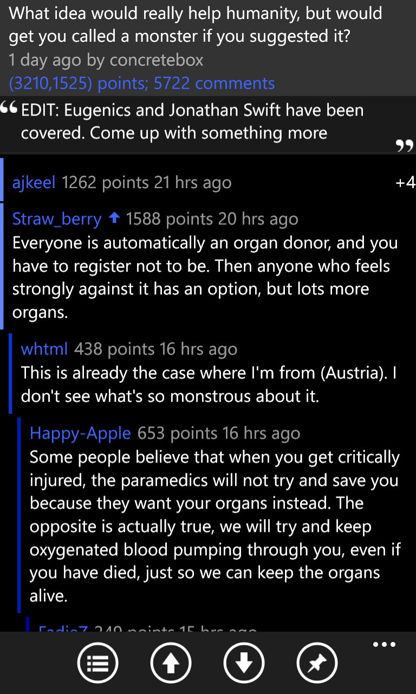

# Baconit

## Facts

| Created | Defunct | Code Repo | Subreddit |
| ------- | ------- | --------- | --------- |
| 2011    | Yes     | [Github](https://github.com/QuinnDamerell/Baconit) | [Subreddit](https://www.redadit.com/r/baconit/) |

## Description

Baconit is a full‑featured Reddit app for Windows Phone. For a long time, it held the top rating in the Windows Phone Store. The app introduced several unique features, including a modern Metro design, Flip View, BaconSync, and a powerful Markdown renderer.

Baconit no longer exits for Windows, Windows Phone, or Xbox. But it lives on in forked versions of the app that are still available on the Windows Store.

### Key Features

#### Flip View

Baconit was the first Reddit app to offer a one‑post‑at‑a‑time, horizontal scrolling view called Flip View. Users could open any subreddit, browse each post in a full‑screen experience, and jump straight to the comments.

#### BaconSync

BaconSync was a free service, and the Firefox/Chrome extension developed by Quinn synchronized “visited” links between Baconit and the browser. Users could instantly see which posts they had already viewed—both on the website and in the app.

#### Universal Markdown

When Baconit was created, no Markdown renderers existed for XAML apps. Because Reddit relies on Markdown in comments, Quinn wrote an efficient parsing and rendering library called Universal Markdown. The library had to be highly performant, as each comment used its control in a virtualized list view.

After its release, the Windows Community Toolkit team asked to merge Universal Markdown into the toolkit, and Quinn happily obliged.

[Link to Universal Markdown GitHub](https://github.com/QuinnDamerell/UniversalMarkdown)

[Link to Windows Community Toolkit GitHub](https://github.com/CommunityToolkit/WindowsCommunityToolkit/tree/main/Microsoft.Toolkit.Uwp.UI.Controls.Markdown)

### April Fools

Baconit pulled off one of the best April Fools’ pranks on Windows Phone: on April 1st, the app simulated a phone shutdown and reboot with a “failed bootloader.” The faux shutdown and boot screens matched the OS exactly, and the gag ended with on‑screen text revealing the joke.

[Link To A Reddit Post About The Prank](https://www.reddit.com/r/baconit/comments/1bpf0w/got_a_pic_of_the_april_fools_joke_nice_one_quinn/)

### Major Versions

- 1.0 for Windows Phone 7.5: Original C# Silverlight version
- 2.0 for Windows Phone 8.0: Ported to the new shared codebase with Windows 8
- 3.0: A big update for Windows Phone 8
- 4.0 Windows 10 (Universal Windows Platform): Final rewrite as a Universal Windows App running on Windows 10, Windows Phone, HoloLens, and Xbox

## Press

### Videos

**Windows Central - Baconit Review**

[YouTube Source](https://www.youtube.com/watch?v=dfo1W8beIXc)

**WMPoweruser.com - WP7 App Review: Baconit**

[YouTube Source](https://www.youtube.com/watch?v=FIcTZlR4nNg)

**Windows Central - Baconit for Windows Phone 8**

[YouTube Source](https://www.youtube.com/watch?v=qAwL_fWz5wc)

### Articles
- Windows Central - [Baconit for Reddit gets rewritten as a stunning universal Windows 10 app](https://www.windowscentral.com/baconit-reddit-stunning-universal-windows-app)
- Windows Central - [Baconit arrives on Xbox One Preview, bringing dank Reddit memes to your console](https://www.windowscentral.com/baconit-arrives-xbox-one-bringing-dank-memes-your-console)
- On MSFT - [Baconit app gets a bunch of new features in major update](https://onmsft.com/news/baconit-app-gets-bunch-new-features-major-update/)
- Windows Central - [Reddit users, your Baconit is here](https://www.windowscentral.com/reddit-users-your-baconit-here)

## Awards

Baconit was entered in Microsoft’s Big App on Campus competition for college students and placed second, earning Quinn and Marilyn a trip to Austin, Texas, for South by Southwest. (The first‑place entry later drew controversy for repackaging an XNA demo game and failing to include the required open‑source code.)

## Videos

<!-- These are hosted on CloudFlare's R2 object storage since Pages can only take up to 25MB -->
### Baconit Update 4.2.0

### Baconit Update 4.1.12

### Baconit Update 2.1

### Baconit  Update 1.6

### BaconSync Announcement

### April Fools Joke

## Images

### App Logos

{: style="height:150px;"}
{: style="height:150px;"}

### 1.0 Screenshots

{: style="height:200px;"}
{: style="height:200px;"}
{: style="height:200px;"}
{: style="height:200px;"}
{: style="height:200px;"}

### 2.0 Screenshots

{: style="height:200px;"}
{: style="height:200px;"}
{: style="height:200px;"}
{: style="height:200px;"}
{: style="height:200px;"}

### 3.0 Screenshots

{: style="height:200px;"}
{: style="height:200px;"}
{: style="height:200px;"}
{: style="height:200px;"}
{: style="height:200px;"}

### 4.0 Screenshots

{: style="height:190px;"}
{: style="height:190px;"}
{: style="height:190px;"}
{: style="height:190px;"}
{: style="height:190px;"}
{: style="height:190px;"}
{: style="height:190px;"}

