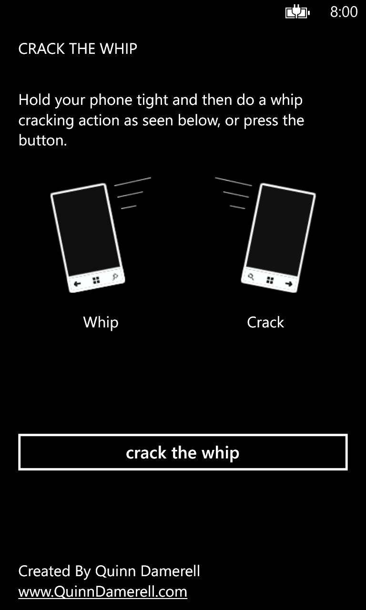

# Crack The Whip

## Facts

| Created | Defunct | Code Repo |
| ------- | ------- | --------- |
| 2014    | Yes      | None |

## Description

The world‑famous (or at least friend‑group‑famous) Crack the Whip app did exactly what its name suggests: it played a whip‑crack sound when users either tapped a button or swung the phone in a whip‑like motion.

Its standout feature was a two‑stage audio effect. Pulling the phone back behind the head triggered the swish of a whip slicing through the air, snapping the phone forward, followed by the sharp crack, completing the illusion.

## Images

### App Icon

{: style="height:150px;"}

### Screenshots

{: style="height:200px;"}

