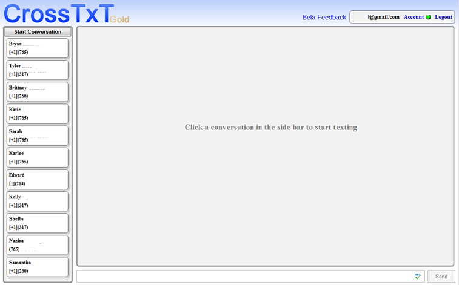
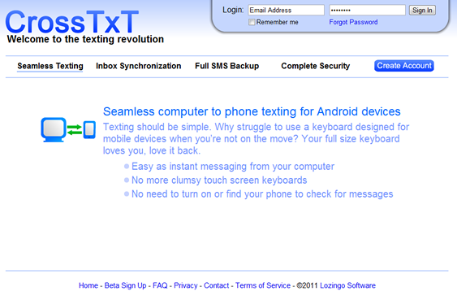
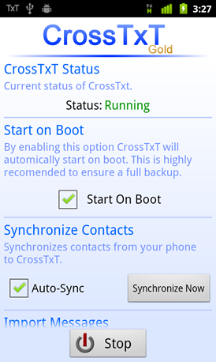
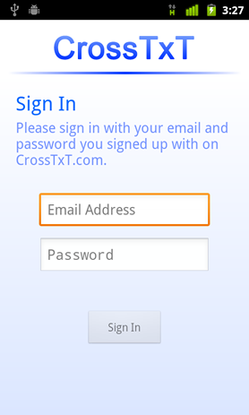

# CrossTxT

**Created In: 2010 - Defunct**

**Created By: Quinn Damerell & Bryan Ehrlich**

## Description

CrossTxT is a cloud‑based text‑messaging system that lets users send texts from any computer with an internet connection. Benefits include sending messages from the user’s own phone number, full inbox synchronization between phone and web, and automatic message backups—delivering a truly cloud‑native experience.

CrossTxT was created to make viewing and responding to texts on a computer effortless. When a message arrives, a desktop pop‑up appears within seconds, and the user can reply directly from the notification. Conversations can also be initiated and browsed on the website exactly as on the phone.

The back‑end is built in PHP with MySQL, complemented by an Android app written in Java.

## Sale

In 2012, Bryan and Quinn sold CrossTxT to a developer from Chicago for $5,000. The app, back‑end, website, and domain have belonged to him ever since.

## Screenshots

{: style="height:200px;"}
{: style="height:200px;"}
{: style="height:200px;"}
{: style="height:200px;"}
