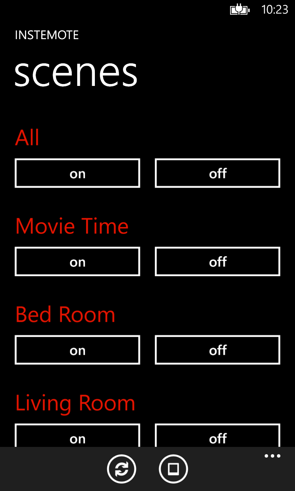
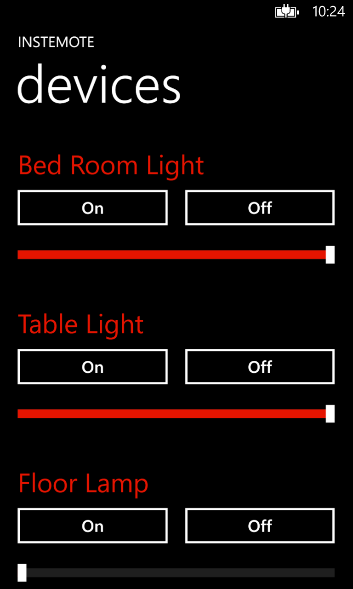

# Instemote

## Facts

| Created | Defunct | Code Repo |
| ------- | ------- | --------- |
| 2013    | Yes      | None |

## Description

Instemote was a lightweight Windows Phone app that controlled lights and scenes in an Insteon smart‑home lighting system.

## Images

### App Icon

{: style="height:150px;"}

### Screenshots

{: style="height:200px;"}
{: style="height:200px;"}

