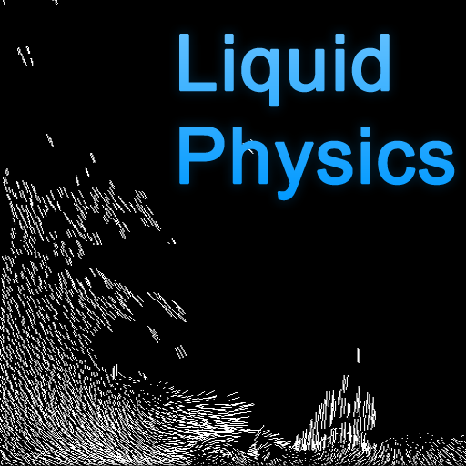

# Liquid Physics Live Wallpaper

## Facts

| Created | Defunct | Code Repo |
| ------- | ------- | --------- |
| 2010    | Yes      | None |

## Description

Liquid Physics Live Wallpaper is a highly customizable live background for Android. Liquid Physics runs a full liquid simulation with gravity that responds to device orientation, giving the impression of real fluid sloshing inside the phone. Users can adjust liquid color, motion blur, gravity sensitivity - including zero‑gravity mode - and particle count.

## Videos

<!-- These are hosted on CloudFlare's R2 object storage since Pages can only take up to 25MB -->

## Images

### App Icon

{: style="height:200px;"}

### Screenshots

{: style="height:200px;"}
{: style="height:200px;"}
{: style="height:200px;"}
{: style="height:200px;"}
{: style="height:200px;"}