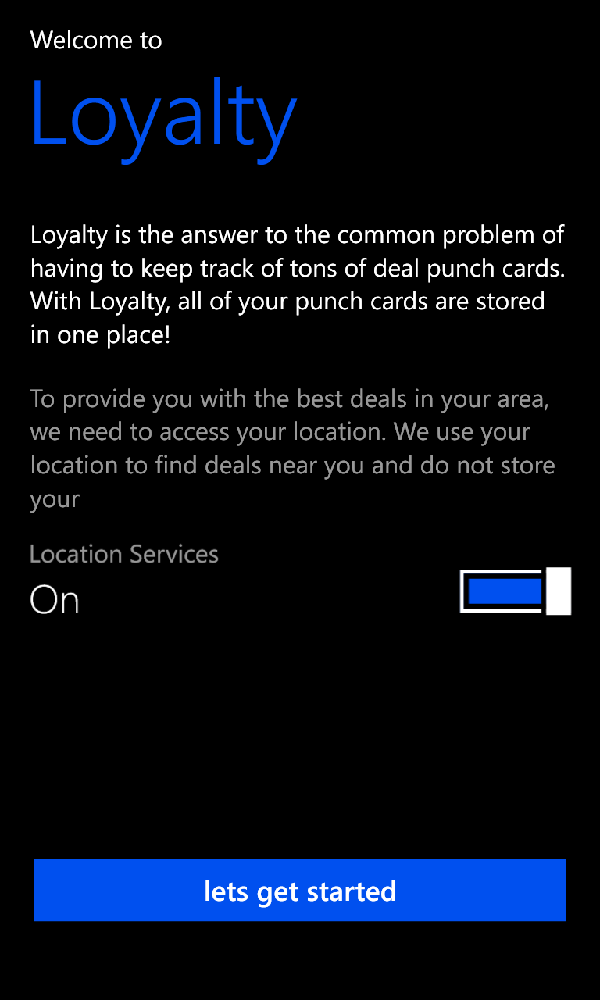
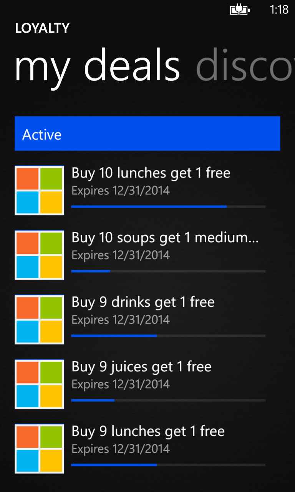
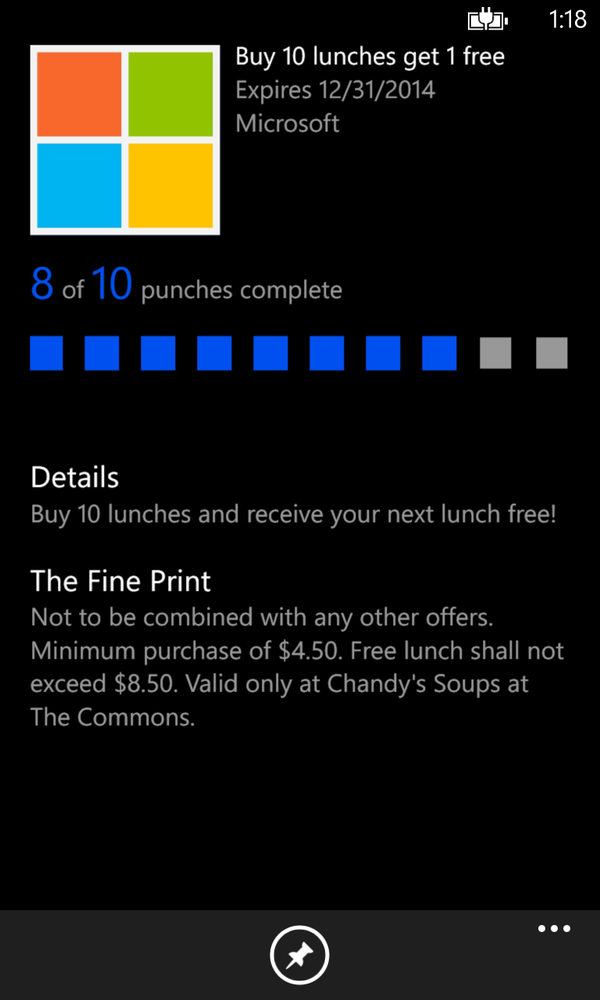

# Loyalty

**Created By: Quinn Damerell & Tyler Jenson**

| Created | Defunct | Code Repo |
| ------- | ------- | --------- |
| 2016    | Yes     | None |

## Description

Loyalty is a free rewards‑tracking and offers app built by Quinn and Tyler for Windows Phone, backed by an Azure web‑service component. It was designed for local businesses to track customer rewards and publish special offers within the app to attract patrons.

Although it never gained local traction, Loyalty was adopted by the Microsoft Commons food court as a free‑meal reward program.

## Images

### Loyalty's Launch At The Microsoft Commons

{: style="height:150px;"}

### App Icon

{: style="height:200px;"}

### Screenshots

{: style="height:200px;"}
{: style="height:200px;"}
{: style="height:200px;"}

