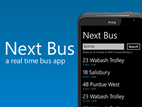

# PurdueBus - A CityBus App for Windows Phone

**Created In: 2011 - Now Defunct**

## Description

Next Bus is a handy app for Boilermakers—and anyone riding CityBus—to view real‑time arrival information. A live map centers on the user’s location and highlights nearby stops. In Stop Viewer mode, the app lists every loop serving the selected stop and refreshes arrival times automatically every 30 seconds. Next Bus covers all CityBus stops across Purdue University’s campus, West Lafayette, and Lafayette, and fully supports Mango and fast app‑switching.

## Screenshots

{: style="height:176px;"}