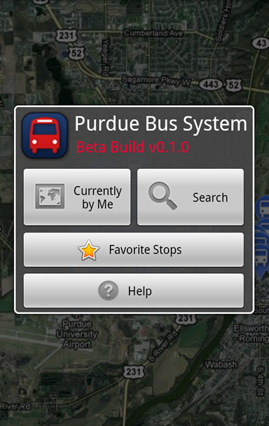
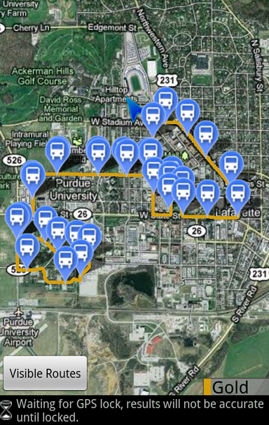
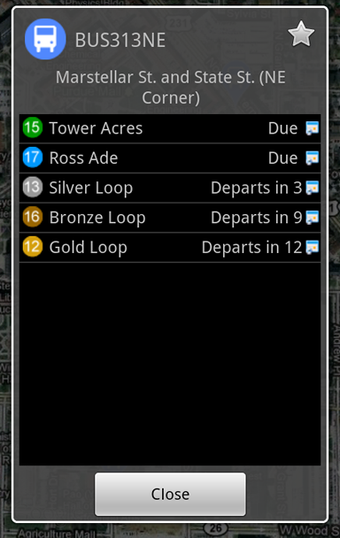
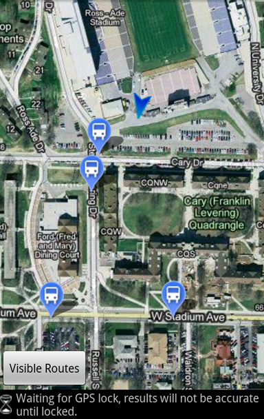
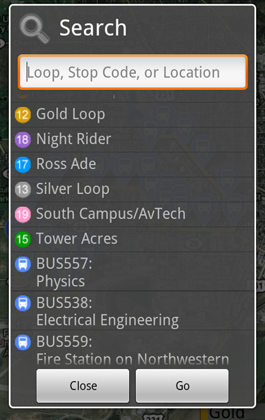

# PurdueBus - A CityBus App for Android

**Created In: 2010 - Now Defunct**

**Developed By: Quinn Damerell & Bryan Ehrlich**

## Description

PurdueBus is an Android app that helps Purdue students quickly find their next bus. For GPS‑enabled phones, it pinpoints the user’s location on campus and displays all nearby CityBus stops. Selecting a stop reveals the scheduled arrival times for every bus.

## Screenshots

{: style="height:200px;"}
{: style="height:200px;"}
{: style="height:200px;"}
{: style="height:200px;"}
{: style="height:200px;"}