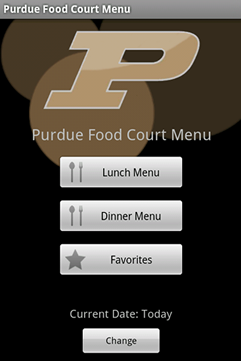
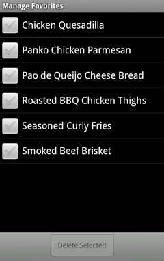

# Purdue Food Court Menu

**Created In: 2010 - Now Defunct**

## Description

Purdue Food Court Menu is an Android app that provides direct access to Purdue’s food‑court menus. It offers a streamlined view of each menu plus handy extras: the food‑court screen shows operating hours and pinpoints each court’s location relative to the user. Users can long‑press any dish to add it to a favorites list and receive alerts whenever a favorite reappears on a future menu.

## Screenshots

{: style="height:200px;"}
{: style="height:200px;"}
{: style="height:200px;"}
{: style="height:200px;"}
{: style="height:200px;"}
