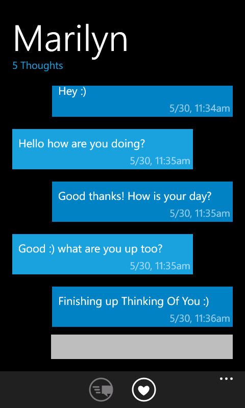
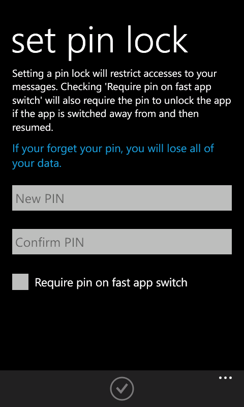

# Thinking Of You

**Created In: 2011 - Now Defunct**

**Created For: Marilyn 🥰**

## Description

Thinking of You is the perfect app for couples, providing an exclusive, private, and secure instant‑messaging channel built just for two.

### Private Connection
Users can set a PIN to lock their conversation. Messages cannot be copied outside the app, and if either partner “breaks the connection,” all data is automatically wiped on both devices.

### Exclusive
Each installation pairs with exactly one other person, creating a personal link. Quick “Thinking of You” pings can be sent throughout the day to let a partner know they’re on someone’s mind.

### Instant Messages
Messages travel instantly via push notifications. Even when the app is closed, toast and live‑tile alerts arrive in real time.

## Screenshots

{: style="height:200px;"}
{: style="height:200px;"}
{: style="height:200px;"}
{: style="height:200px;"}
{: style="height:200px;"}
