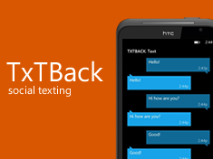

# TxTBack

**Created In: 2009 - Now Defunct**

## Description

The idea of TxTBack was to create a social experience in which users anonymously texted a single phone number, with their messages forwarded to another participant. The pair remained connected until one chose to switch, enabling extended conversations.

After being posted on Reddit, the project gained traction, but its Google Voice implementation soon hit rate‑limit restrictions and the project was shutdown. The only alternative to Google Voice at the time were SMS API services, which were very expensive.

## Screenshots

{: style="height:160px;"}
